# Heart Disease Prediction Project

## Table of Contents
1. [Project Overview](#project-overview)
2. [Features and Workflow](#features-and-workflow)
3. [Technologies Used](#technologies-used)
4. [Results](#results)
5. [Highlight_Visualizations:](#Highlight-Visualizations:)
6. [How to Run](#how-to-run)
7. [Dataset](#dataset)
8. [Conclusion](#conclusion)
9. [Contact](#contact)

## Project Overview
Heart attacks, a critical form of cardiovascular disease, happen when blood flow to the heart is suddenly blocked. The World Health Organization (WHO) reports that about 17.9 million people lose their lives to heart-related conditions each year. Research shows that factors like lifestyle choices and health indicators play a major role in determining heart disease risk.

This project dives into a dataset filled with medical details about individuals to predict the likelihood of heart disease. By leveraging data analysis and machine learning, I aimed to classify whether a person is at high or low risk and pinpoint which algorithms work best for this purpose.


## Features and Workflow
1. **Data Preprocessing:**
   - Addressed missing values and handled imbalanced data to ensure accuracy.
   - Scaled and normalized features to enhance the performance of machine learning models.

2. **Exploratory Data Analysis (EDA):**
   - Analyzed the relationships between different health factors and the risk of heart disease.
   - Created visualizations with Matplotlib and Seaborn to uncover patterns in the data.

3. **Feature Engineering:**
   - Identified and selected features most relevant to improving model predictions.
   - Introduced new features to better represent the dataset’s patterns.

4. **Model Implementation:**
   - Tested algorithms such as Logistic Regression, Decision Trees, Random Forest, SVM, and KNN.
   - Assessed performance with metrics like accuracy, precision, recall, F1 score, and AUC-ROC.

## Technologies Used
- **Programming Language:** Python
- **Libraries:** Pandas, NumPy, Scikit-learn, Matplotlib, Seaborn, Torch, D-Tale, Sweetviz
- **Platform:** Jupyter Notebook

## Results
The project’s best-performing model demonstrated impressive accuracy and AUC-ROC scores, showing its ability to predict heart disease risk effectively. Visualizations and metrics were generated to make the results clear and actionable.

## Highlight Visualizations:
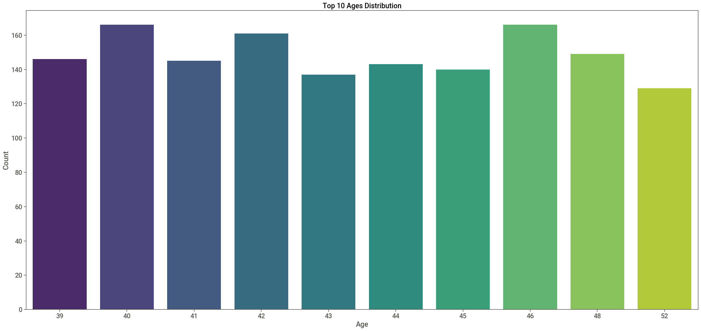
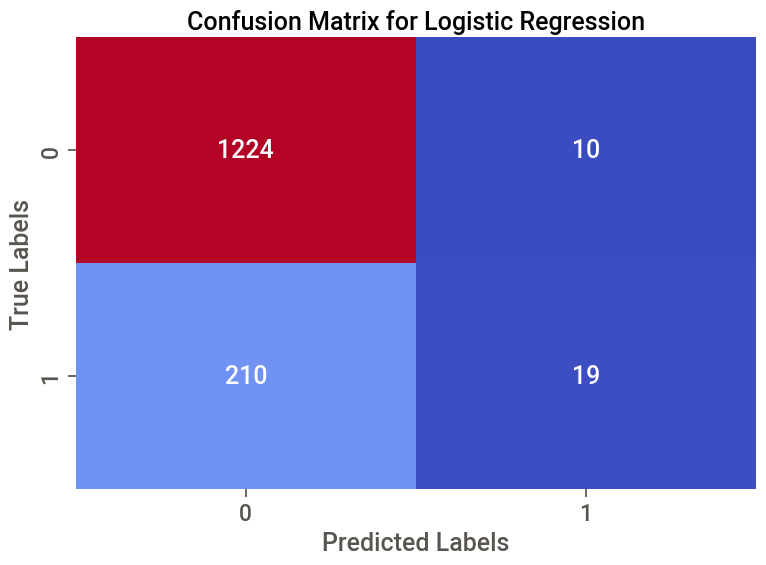
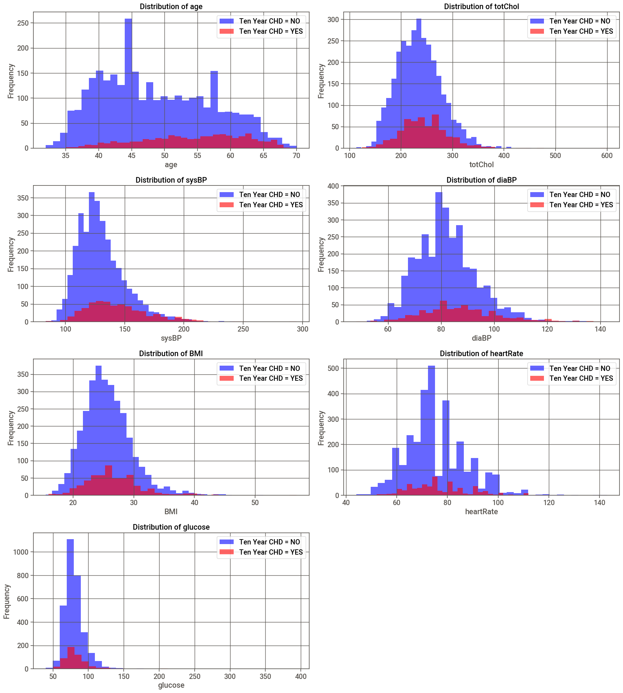
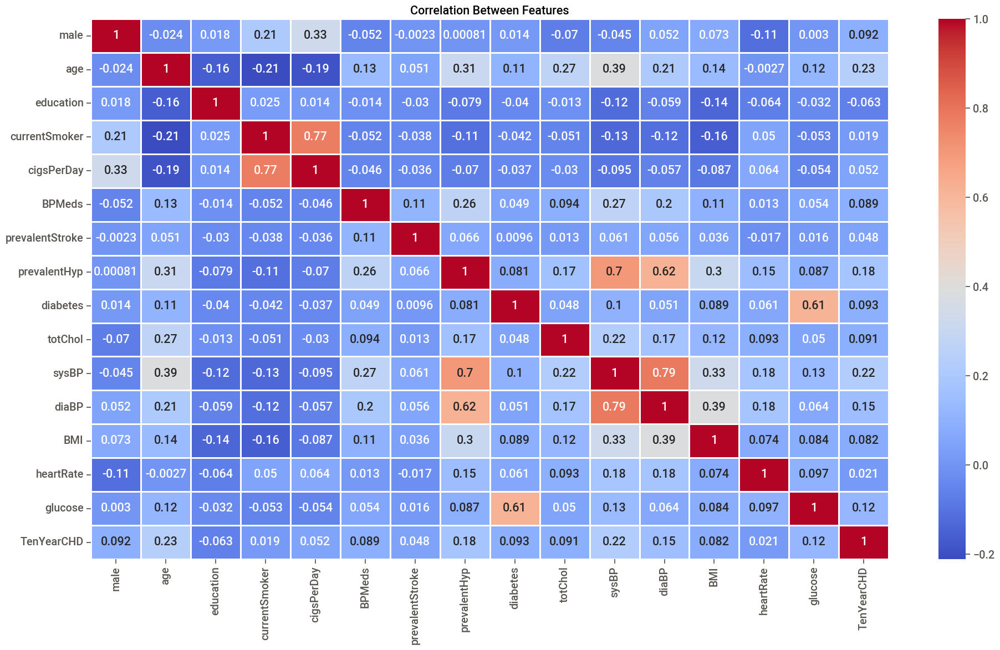
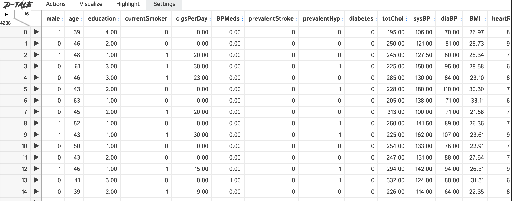
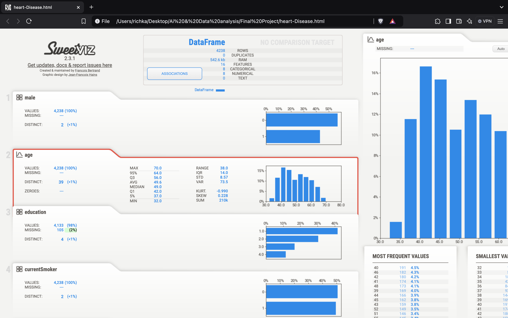
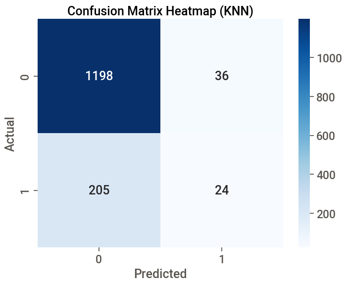
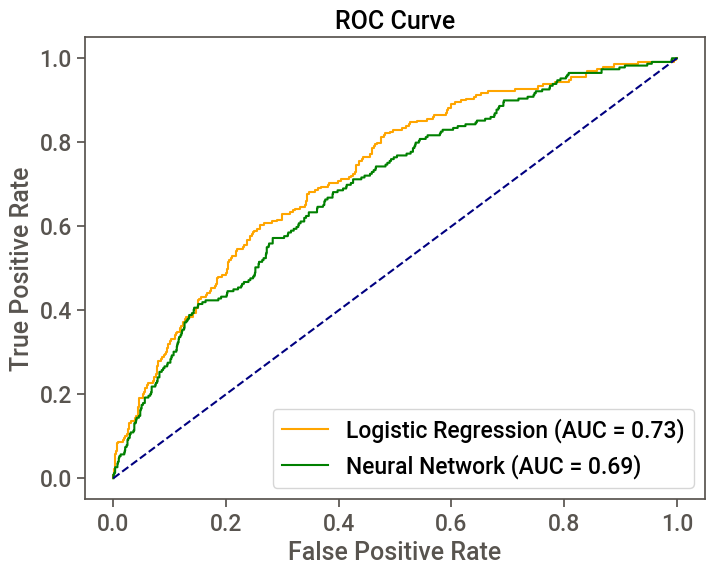
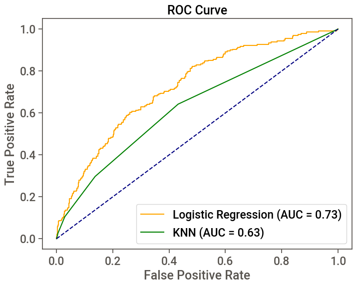
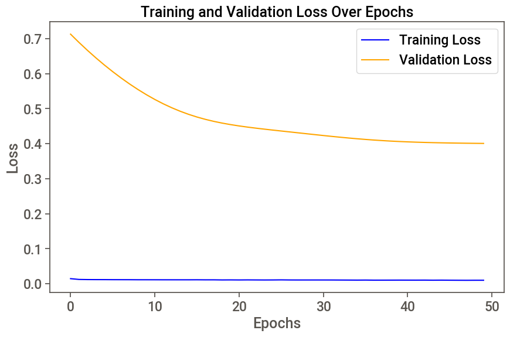
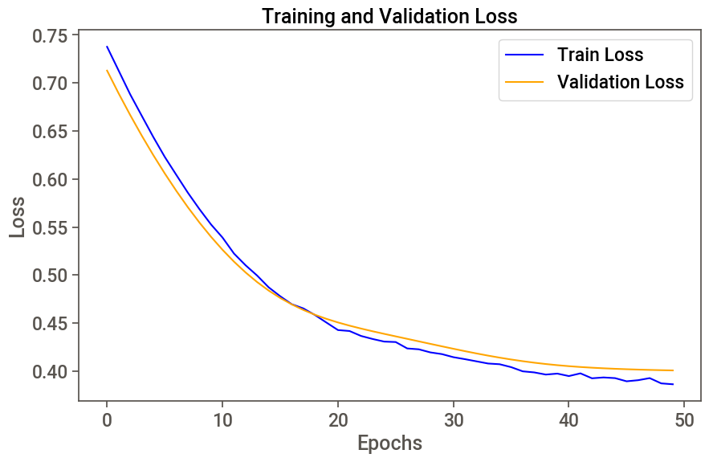

## How to Run
1. Clone the repository:
   ```bash
   git clone https://github.com/Rich-kaM/.git
   ```
2. Navigate to the project folder:
   ```bash
   cd heart-disease-prediction
   ```
3. Install dependencies:
   ```bash
   pip install -r requirements.txt
   ```
4. Open the Jupyter Notebook:
   ```bash
   jupyter notebook
   ```
5. Follow the notebook steps to see data preprocessing, analysis, and results.
6. For Sweetviz reports, ensure your default web browser is set up to display them automatically.

## Dataset
The dataset used is publicly available on [Kaggle](https://www.kaggle.com/datasets/dileep070/heart-disease-prediction-using-logistic-regression?resource=download). Make sure to download and place it in the project folder before running the notebook.

## Conclusion
This project demonstrates how machine learning can be a game-changer in predicting heart disease risks. Here are some key takeaways:
1. **Top Performer:** Extreme Gradient Boosting (XGBoost) emerged as the most accurate algorithm for this dataset.
2. **Key Indicators:** Features like chest pain type and exercise-induced angina were significant predictors of risk, confirming insights from medical literature.
3. **Ensemble Power:** Combining models through techniques like Random Forest and XGBoost proved more effective than single-model approaches.
4. **Real-World Impact:** These predictions can aid healthcare providers in early diagnosis and treatment, ultimately improving patient outcomes.

This project underscores how data-driven solutions can revolutionize healthcare by enabling timely interventions and informed decisions.

## Contact
If you have any questions, suggestions, or feedback, feel free to reach out:
- **Email:** [richardmukulu73@gmail.com](mailto:richardmukulu73@gmail.com)
- **GitHub:** [Rich-kaM](https://github.com/Rich-kaM)

